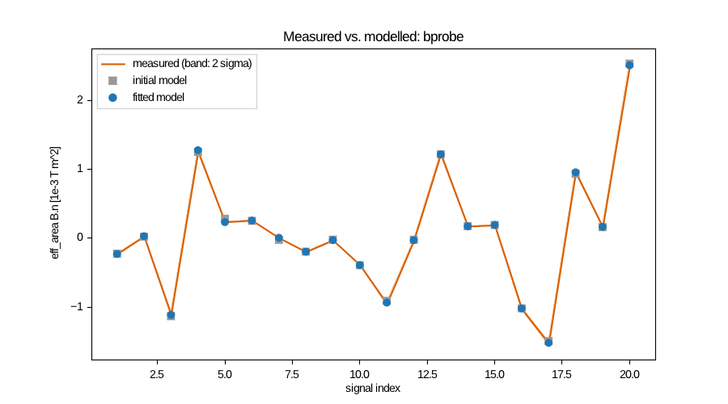
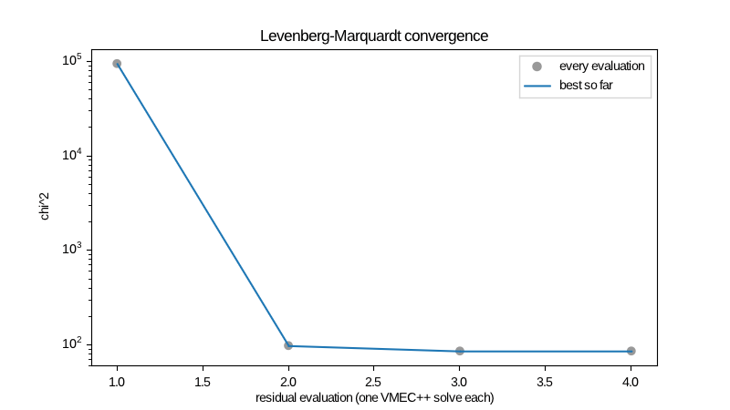
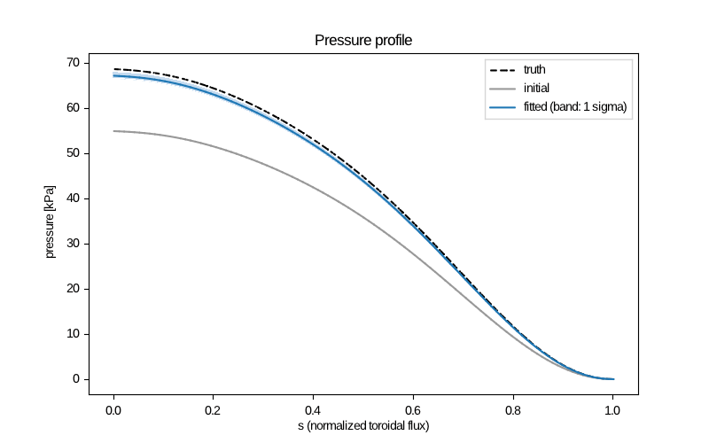
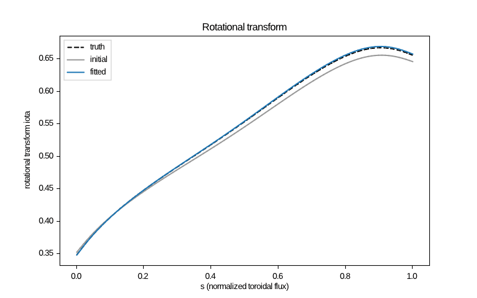

# Synthetic equilibrium reconstructions

The scripts here reconstruct known equilibria from synthetic magnetic data with
`tiago_reconstruct`. Each fit uses VMEC++ equilibria, Tiago's plasma and coil
signals, and Levenberg–Marquardt with the exact adjoint Jacobian.

The scripts need no Python. They need a build with
`-DTIAGO_ENABLE_RECONSTRUCTION=ON` (see the top-level README), plus `awk`, `bc`
and `curl`. They are not part of `ctest`. `ctest` runs smaller cases instead:
- `tests/reconstruct_exact.sh`, a noise-free LI383 fit;
- the adjoint check against finite differences, with its block-by-block
  verification.

```bash
./run.sh ../../build-vmecpp 20     # LI383: 3 cases and a 20-seed pull study (about 2 min)
./run_ncsx.sh ../../build-vmecpp   # full-resolution NCSX with coils, and VMEC2000 (about 7 min)
```

Timings were measured on the 4-core VM this was developed on; they vary by about 15 % between runs.

## LI383 (`run.sh`)

**Setup.**
- **Equilibrium.** simsopt's `input.li383_low_res` at a pinned commit:
  NS 16, MPOL 4, NTOR 3, NCURR 1. VMEC++ solves it to FTOL 1e-14.
- **Sensors.** `sensors.awk` puts 80 of them on a torus with R0 = 1.42 m and
  r = 0.85 m around the plasma:
  - 6 diamagnetic loops, 5 toroidal loops and 24 saddle loops;
  - 24 segmented Rogowskis and one Ampère loop;
  - 20 B-probes.

  The probe orientations come from a fixed-seed generator, so the sensor
  files are identical on every machine.
- **Data.** The model is evaluated at the true parameters, with noise of
  sigma = 1 % |S| plus a floor per kind.
- **Plasma sheet.** 64 × 64 grid per field period.
- **Start values.** 5–30 % off the truth.

| case | parameters | LM steps | VMEC++ solves | chi²/dof | max \|pull\| | wall (1 thread) |
|---|---|---|---|---|---|---|
| `exact` (no noise) | PRES_SCALE, CURTOR, AC(1), PHIEDGE | 3 | 5 | 1e-6 | 0.007 | 7.0 s |
| `noisy` | same | 3 | 5 | 0.85 | 0.93 | 6.6 s |
| `shape` | same + RBC(0,1), ZBS(0,1), RBC(1,1), ZBS(1,1) | 4 | 6 | 0.83 | 2.1 | 21.8 s |

Pull = (fitted − truth) / sigma, with sigma from the linearised covariance.

The fit stops when the Gauss–Newton model predicts a χ² decrease below 1e-3.
That is the reproducibility of χ² for equilibria solved to FTOL and
hot-restarted. So the noise-free fit ends within about √1e-3 ≈ 0.03 σ of the
truth.

**Pull study.** 20 noise seeds of the `noisy` case (`results/pulls.*`). If the
covariance is right, the pulls have mean 0 and standard deviation 1. The
standard error of the mean over 20 seeds is 0.22.

| parameter | mean | std |
|---|---|---|
| PRES_SCALE | 0.03 | 1.00 |
| CURTOR | 0.21 | 0.95 |
| AC(1) | −0.04 | 1.08 |
| PHIEDGE | 0.02 | 1.02 |


Magnetics alone do not separate `PRES_SCALE` from the shape of the pressure
profile. With `AM(1)` also free, the uncertainty of PRES_SCALE grows by two
orders of magnitude. In that case, fit one of the two, or give the other a
prior (`prior_sigma`).

| | |
|---|---|
|  |  |
|  |  |
|  |  |

## NCSX at full resolution, with coils (`run_ncsx.sh`)

**Setup.**
- **Equilibrium.** STELLOPT's `input.ncsx`: MPOL 11, NTOR 6, NS 9/29/49/99,
  FTOL 1e-12, about 45k unknowns. It is solved at fixed boundary, with the
  boundary taken from STELLOPT's free-boundary `wout_ncsx.nc`
  (`vmec_boundary_wout`).
- **Parameters.** Six: the three modular-coil currents EXTCUR(1:3) of
  `coils.NCSX`, plus PHIEDGE, CURTOR and PRES_SCALE.
- **Data.** 80 magnetic signals on a torus with R0 = 1.44 m and r = 0.55 m,
  and 12 consistency points on the magnetic axis. At those points the coil
  field plus the plasma sheet field must vanish, to 1 mT (36 residuals).
  This takes the place of a free-boundary solve.

| | result |
|---|---|
| LM steps / VMEC++ solves | 3 / 5 |
| chi² start → fitted (dof 110) | 9.3e4 → 84.2 (0.77 per dof) |
| wall time, 4 cores | 157 s, of which Jacobians 111 s (4 of them) and VMEC++ solves 40 s (1 cold, 4 hot-restarted) |
| peak memory | 1.47 GB |

| parameter | fitted | sigma | truth | pull |
|---|---|---|---|---|
| EXTCUR(1) | 651006 A | 865 A | 652272 A | −1.5 |
| EXTCUR(2) | 651354 A | 823 A | 651869 A | −0.6 |
| EXTCUR(3) | 536664 A | 680 A | 537744 A | −1.6 |
| PHIEDGE | 0.49653 Wb | 0.00055 Wb | 0.49707 Wb | −1.0 |
| CURTOR | −179647 A | 773 A | −178606 A | −1.4 |
| PRES_SCALE | 0.9786 | 0.0093 | 1 | −2.3 |

**Consistency floor.** The pulls lean negative for a physical reason: the
reference is not exactly self-consistent. With noise-free data, even at the
true parameters, the consistency residual is χ² = 24.7 over 36 points, about
0.8 mT on a 1.7 T axis (`results/ncsx/consistency_floor.txt`). This mismatch
is between STELLOPT's free-boundary equilibrium and its fixed-boundary
re-solve with the sheet model.
- A finer sheet (96 × 96) leaves it unchanged, so it is not sheet
  discretisation.
- The same level appears when the reference wout is used directly.

It belongs to the reference, from mgrid interpolation and NESTOR, plus the
angular-truncation gap of #25. The fit trades it against the measurements,
which shifts the parameters by 1–2σ. For a real reconstruction,
`consistency_sigma` should be set at this level.

**VMEC++ against VMEC2000.** The same fixed-boundary NCSX input was solved by
VMEC2000 (the Fortran VMEC that STELLOPT uses, built by
`../xdiagno/build_xdiagno.sh --vmec`) and by VMEC++. The plasma signals of both
equilibria, on the same sensors, agree as follows (maximum difference over
largest signal, `results/ncsx/vmec2000.txt`):

| signals | agreement |
|---|---|
| 35 flux loops | 4e-5 |
| 20 B-probes | 3e-4 |
| 25 segmented Rogowskis | 1.6e-3 |

Two independent codes agree far below the 1 % measurement noise. Tiago's
signals agree with xdiagno to a few 1e-6 (`../xdiagno`).

### Compared with STELLOPT

For one equilibrium solve on this VM, same input and tolerances, one core:

| | wall | peak memory |
|---|---|---|
| VMEC2000 | 99 s | 60 MB |
| VMEC++ (cold, multigrid) | about 40 s (15 s hot-restarted) | — |

STELLOPT reconstructs with finite-difference Jacobians. Each iteration needs at
least one VMEC run per parameter, plus the base run, and a DIAGNO evaluation
for each; a free-boundary coil fit adds NESTOR to every run. Tiago's cost per
iteration does not depend on the number of parameters. Compare for this
6-parameter NCSX fit:

| | Tiago | STELLOPT (estimate from the VMEC2000 timing) |
|---|---|---|
| VMEC runs per iteration | 1 | at least 7 |
| wall time, whole fit | 157 s on 4 cores | about 35 min serial for 3 iterations (21 × 99 s), or about 5 min on 7 MPI ranks |
| memory | 1.47 GB (4 thread-local models and the block LU of the adjoint) | 60 MB per rank, plus the mgrid file |
| Jacobian | adjoint; per-iteration cost independent of the parameter count | forward differences; accuracy limited by the ~1e-6 solver accuracy against the step size |

The estimate assumes STELLOPT's evaluations run in parallel. It leaves out
DIAGNO and NESTOR, which only add to STELLOPT's time.

**Jacobian accuracy.** On LI383 the adjoint agrees with finite differences of
re-solved equilibria to 1e-4. At NCSX mode numbers the agreement degrades to
0.1–2.5 %. VMEC++'s own reference implementation (`vmecpp.autodiff`)
reproduces this on the same input, so it is an upstream limitation; it is
tracked in #27 for reporting to VMEC++. It does not bias the fit: LM converges
to the minimum of the exactly evaluated χ². Tiago's own linear algebra is exact
against the Hessian-vector products (`TIAGO_VMECPP_VERIFY`).

| | |
|---|---|
|  |  |
|  |  |

`results/<case>/` also holds `summary.txt`, `parameters.csv` and the timings.
