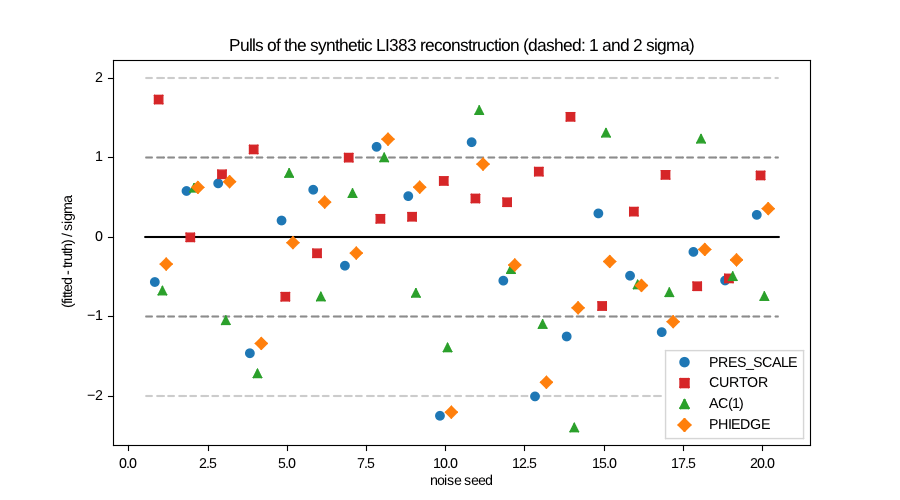
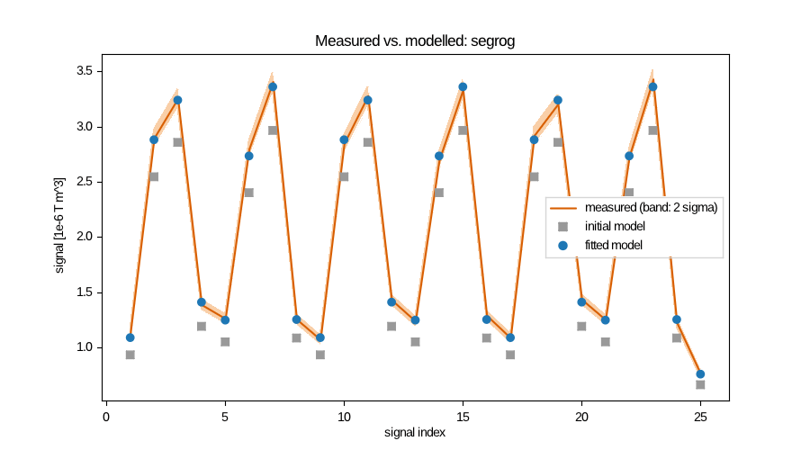
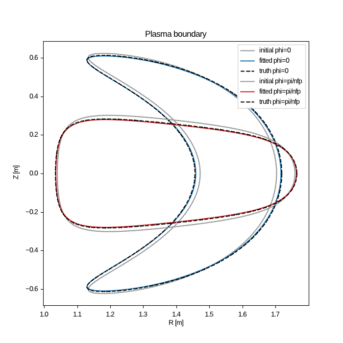
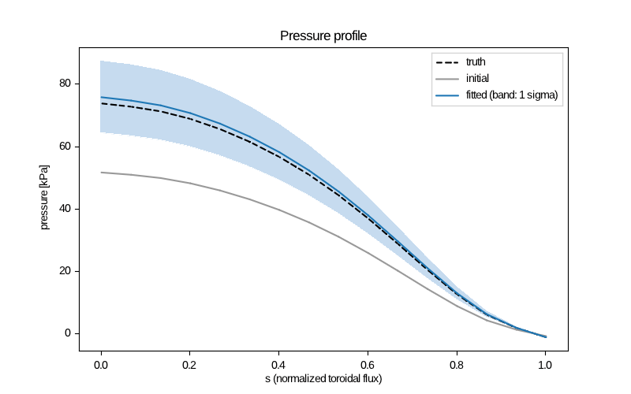
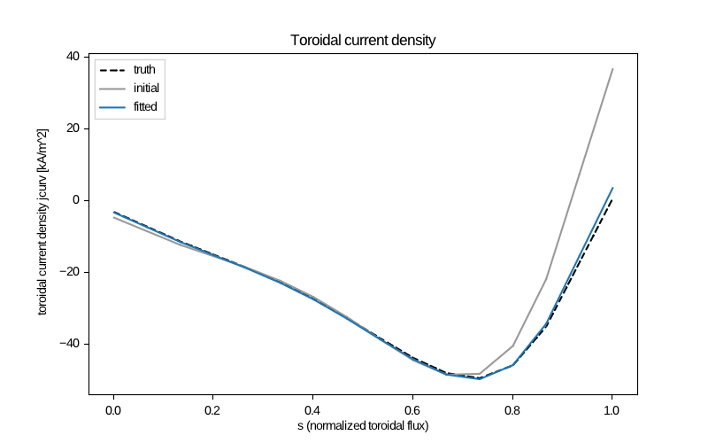
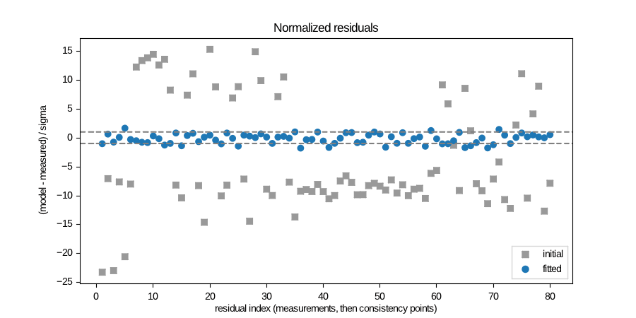
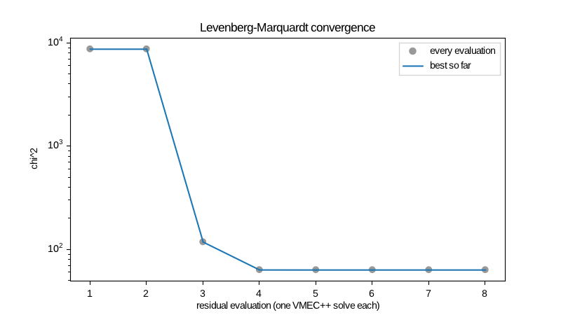

# Synthetic equilibrium reconstructions (LI383)

`run.sh` reconstructs the LI383 equilibrium from synthetic magnetic data with
`tiago_reconstruct`: VMEC++ equilibria, Tiago's plasma and coil signals, and
Levenberg–Marquardt with the exact adjoint Jacobian. It needs no Python, only a
build with `-DTIAGO_ENABLE_RECONSTRUCTION=ON` (see the top-level README), `awk`,
`bc` and `curl`.

```bash
./run.sh ../../build-vmecpp 20     # build dir, number of noise seeds
```

It is not part of `ctest`. `ctest` runs a smaller noise-free case
(`tests/reconstruct_exact.sh`), about 13 s.

## Setup
- **Equilibrium.** simsopt's `input.li383_low_res` at a pinned commit:
  NS = 16, MPOL = 4, NTOR = 3, NCURR = 1. It is solved by VMEC++ to
  FTOL = 1e-14.
- **Sensors.** `sensors.awk` puts them on a torus with R0 = 1.42 m and
  r = 0.85 m around the plasma:
  - 6 diamagnetic loops (`idia = 1`);
  - 5 toroidal loops;
  - 24 saddle loops;
  - 24 segmented Rogowskis and one Ampère loop;
  - 20 B-probes.

  That makes 80 signals.
- **Synthetic data.** The model is evaluated at the true parameters, with
  Gaussian noise of sigma = 1 % |S| plus a floor per kind (`add_noise`, `seed`).
- **Plasma sheet.** 64 × 64 grid per field period, 4 Gauss points per segment.
- **Timings.** One thread, measured on the 4-core VM this was developed on.

## Results

| case | parameters | LM steps | VMEC++ solves | chi²/dof | max \|pull\| | wall time |
|---|---|---|---|---|---|---|
| `exact` (no noise) | PRES_SCALE, CURTOR, AC(1), PHIEDGE | 4 | 6 | 2e-14 | 7e-7 | 30.5 s |
| `noisy` (seed 1) | same | 4 | 6 | 0.83 | 1.72 | 31.9 s |
| `shape` (seed 1) | same + RBC(0,1), ZBS(0,1), RBC(1,1), ZBS(1,1) | 5 | 7 | 0.87 | 0.74 | 36.3 s |

Pull = (fitted − truth) / sigma, with sigma from the linearised covariance.
The starting values are 5–30 % off the truth (see `run.sh`).

The pull study covers 20 noise seeds of the `noisy` case (`results/pulls.*`).
If the covariance is right, the pulls have mean 0 and standard deviation 1;
the standard error of the mean over 20 seeds is 0.22:

| parameter | mean | std |
|---|---|---|
| PRES_SCALE | −0.28 | 0.98 |
| CURTOR | 0.39 | 0.73 |
| AC(1) | −0.29 | 1.10 |
| PHIEDGE | −0.25 | 0.91 |



**Where the time goes** in the `shape` case, 34.6 s CPU in total:
- VMEC++ solves: 1.3 s.
- Adjoint Jacobians: 11.5 s, for 6 dense-LU factorisations and 480 adjoint
  right-hand sides.
- The rest (about 22 s) is Tiago's plasma sheet: the signals, and their field
  and shape responses at 64 × 64.

Magnetics alone do not separate `PRES_SCALE` from the shape of the pressure
profile: with `AM(1)` also free, the uncertainty of PRES_SCALE grows by two orders of magnitude.
In that case, fit one of the two, or give the other a prior (`prior_sigma`).

### Figures (`shape` case)
| | |
|---|---|
|  |  |
|  |  |
|  |  |

`results/<case>/` also holds `summary.txt`, `parameters.csv` and `time.txt`.
